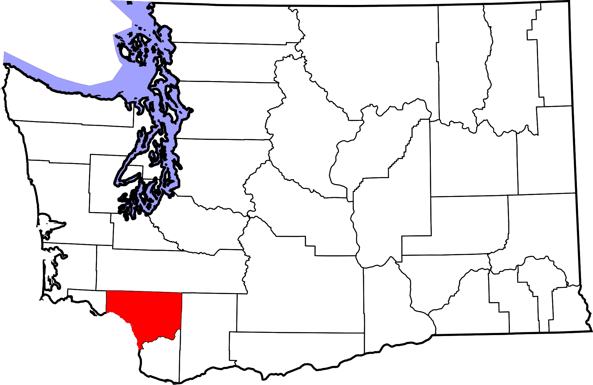
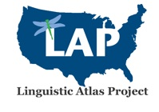
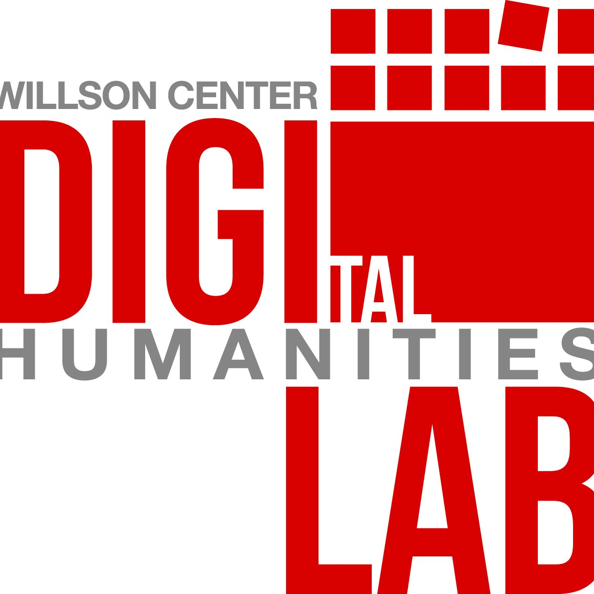
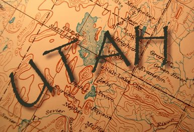

Research
========

<h2>Cowlitz County, Washington</h2>

My main research project is on English in the Pacific Northwest. In 2016 I conducted 54 sociolinguistic interviews in <a href="https://www.google.com/maps/place/Cowlitz+County,+WA/@46.1203776,-123.0089545,10z/data=!3m1!4b1!4m5!3m4!1s0x549415fb272f02b1:0x925df86af59a9d68!8m2!3d46.1746472!4d-122.7746902" title="Cowlitz County, Washington">Cowlitz County, Washington</a> and I’ve only scratched the surface in analyzing that data. I have recently given presentations about the <i>Mary-merry-marry</i> and the <i>pull-pole</i> mergers in this area. I also have access to the original handwritten data from the <em><a href="https://scholar.google.com/scholar?hl=en&amp;q=%22Linguistic+Atlas+of+the+Pacific+Northwest%22&amp;btnG=&amp;as_sdt=1%2C11&amp;as_sdtp=">Linguistic Atlas of the Pacific Northwest</a></em>—which, as far as I know, hasn’t seen the light of day for several decades. I’m hoping to incorporate that into my work, though admittedly I haven't gotten too far yet.

<h2>Linguistic Atlas Project</h2>

My funding is through the <a href="http://www.lap.uga.edu/" title="Linguist Atlas Project">Linguistic Atlas Project</a> where I handle most of the coding and phonological processing of data. As part of a recent NSF grant, with Drs. <a href="https://www.english.uga.edu/directory/495/detail">Bill Kretzschmar</a> and <a href="https://faculty.franklin.uga.edu/mrenwick/about" title="Peggy Renwick">Peggy Renwick</a> as co-PIs, a handful of grad students and about three dozen undergrads are actively transcribing and processing a 64-speaker subset of the Linguistic Atlas of the Gulf States (LAGS). This data has never been processed yet, and we're running into a lot of "fun" obstacles in dealing with very scratchy recordings of southern speakers from the 1970s. This is a very active project and we are going to a lot of conferences with preliminary work.

<h2>UGA DigiLab</h2>

I also work with the UGA <a href="https://digi.uga.edu" title="DigiLab main page">DigiLab</a> where I give seminars and workshops on how to help students and faculty use computers effectively in their humanities research. I also do one-on-one consultations. Though I'm not actively publishing in this field, I do produce a series of useful resources as a part of this work. I've presented in the DigiLab Colloquium series (

). I've also given workshops on how to increase your online presence (

) and on <a href="/excel.html">Excel</a>.

<h2>Utah English</h2>

Though not an active area of research for now, I am interested in Utah English. I worked on a poster involving vowel mergers over time in a single speaker (<a href="https://www.academia.edu/26986601/Phonetic_Shift_ɔr_Phonemic_Change_American_English_mergers_over_40_years">Stanley &amp; Renwick 2016</a>), and currently, with data from <a href="https://sites.ualberta.ca/~bvtucker/">Ben Tucker</a> at the University of Alberta, we are digging a little deeper into that. Utah is a unique place: its settlement history and highly concentrated Mormon population has had an impact on the English spoken in the region. I think it deserves some more attention by sociolinguists and dialectologists.

