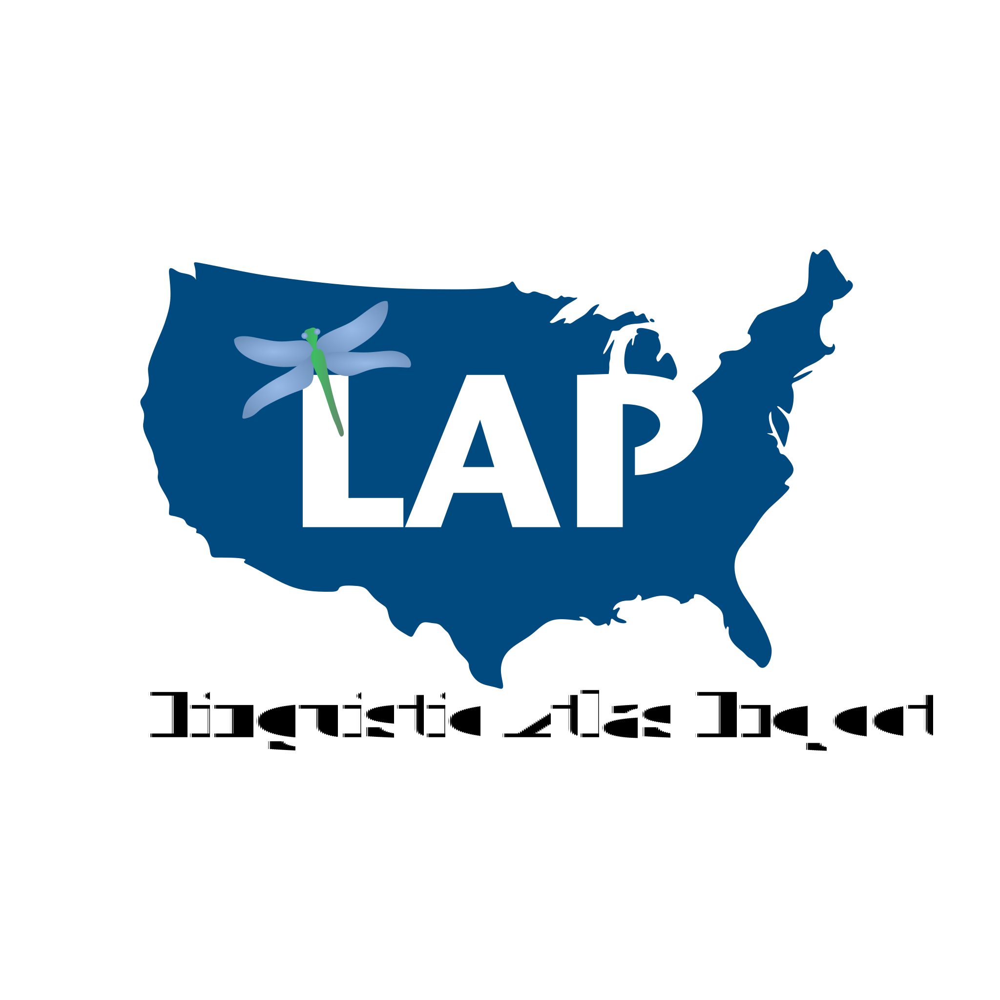
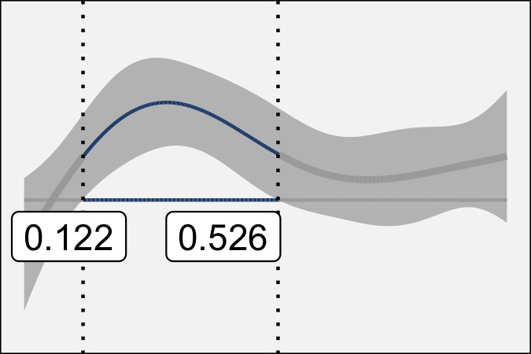
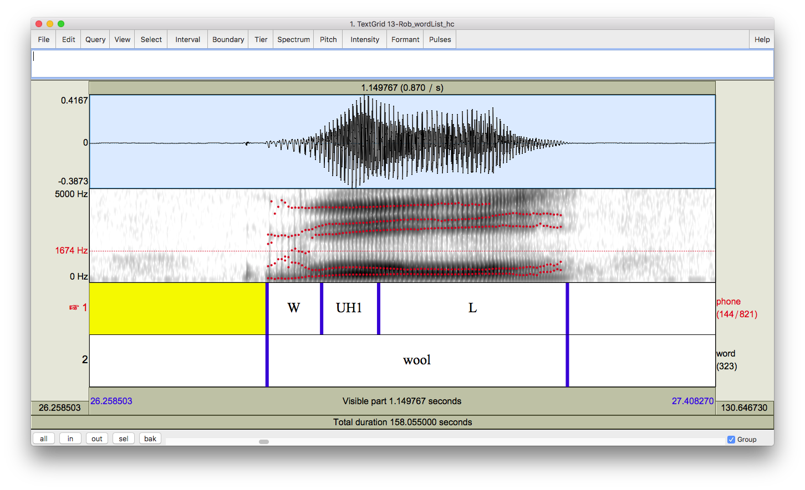

# Research

This page highlights some of my research, organized thematically. I am a dialectologist, so several of my research interests are on specific regions. But intersecting these regions is where the sociolinguist in me comes out, and I try to uncover the meaning in linguistic variants---particularly the infrequent ones. And I go about these questions in these areas as a phonetician, analyzing speech production data and vowel trajectories. Finally, in nearly every study, I put on my quantitative linguist/data scientist/statistican cap when I actually do the analysis and interpretation. I think it's a great intersection of subdisciplines within linguistics and I'm kept on my toes trying to keep up with each field.

 

---------------------------------------------------------

 

## Cowlitz County, Washington

In grad school, I did some fieldwork in [Cowlitz County, Washington](https://www.google.com/maps/place/Cowlitz+County,+WA/@46.1203776,-123.0089545,10z/data=!3m1!4b1!4m5!3m4!1s0x549415fb272f02b1:0x925df86af59a9d68!8m2!3d46.1746472!4d-122.7746902), and since not a lot of research is done in the Pacific Northwest, I've been trying to document the English spoken there. In my dissertation, I showed that the younger people are shifting their front lax vowels like in other parts of the US and Canada. I've also done a couple spin-off studies on <sc>bag</sc>-raising, prelateral mergers, and prerhotic mergers. It's a fun area and look forward to uncovering more detail on southwest Washington!

<h3>CV Highlights</h3>

**Joseph A. Stanley** (2020). "Vowel Dynamics of the Elsewhere Shift: A Sociophonetic Analysis of English in Cowlitz County, Washington." Ph.D Dissertation. University of Georgia, Athens, GA.

**Joseph A. Stanley** (2018). "Changes in the Timber Industry as a Catastrophic Event: <sc>bag</sc>-Raising in Cowlitz County, Washington" *Penn Working Papers in Linguistics, 24(2).*

**Joseph A. Stanley**. (2017). “The perception and production of two vowel mergers in Cowlitz County, Washington.” Paper presented at the American Dialect Society Annual Meeting. Austin, TX.

 

---------------------------------------------------------

 

## Utah English

Another area I focus on in the West is Utah. I worked on a <a href="/downloads/160714-LabPhon15-poster.pdf">poster</a> involving vowel mergers over time in a single speaker. Most recently, I've been working with Kyle Vanderniet on consonantal variation in Utah English, as in the words <i>mountain</i> and <i>false</i> or in word-final <i>-ing</i>. I was also able to conduct additional fieldwork in Utah County but I'd really like to do some more. Utah is a unique place: its settlement history and highly concentrated Mormon population has had an impact on the English spoken in the region. I think it deserves some more attention by sociolinguists and dialectologists.

<h3>CV Highlights</h3>

**Joseph A. Stanley** (2019). "(thr)-Flapping in American English: Social factors and articulatory motivations." *Proceedings of the 5th Annual Linguistics Conference at UGA*, 49–63.

**Joseph A. Stanley** & [Kyle Vanderniet](https://clyguy.wixsite.com/profile) (2018). "Consonantal Variation in Utah English." *Proceedings of the 4th Annual Linguistics Conference at UGA*, 50--65. 

Also, keep an eye out for blog posts tags with [***Utah***](/tags/index#Utah)!

 

---------------------------------------------------------

 

## The South

Having firmly established myself as a researcher of Western American English, I was reluctant to start doing research on the South since the amount of existing literature is vast. But, as a research assistant for the Linguistic Atlas Project for four years, I couldn't help but begin analysis on DASS, a newly transcribed corpus of interviews from the 1970s and 1980s. Together with Peggy Renwick and the others at the Linguistic Atlas team, we've dug deep into the phonetics of how southerners sounded a couple generations ago. You can see and interact with some of this data by going a site I made called the <a href="http://lap3.libs.uga.edu/u/jstanley/vowelcharts/" title="GSV"><i>Gazetteer of Southern Vowels</i></a>.

### CV Highlights

Margaret E. L. Renwick & **Joseph A. Stanley** (2020). "Modeling dynamic trajectories of tense vs. lax vowels in the American South." *Journal of the Acoustical Society of America* 147(1): 579--595. doi: 10.1121/10.0000549. 

**Joseph A. Stanley** & Margaret E. L. Renwick. "Back vowel distinctions and dynamics in Southern US English." The 94th Annual Meeting of the Linguistic Society of America. New Orleans, LA. January 2--5, 2020.

**Joseph A. Stanley**. "Real Time Vowel Shifts in Georgia English." The 6th Annual Linguistics Conference at UGA ([LCUGA6](http://linguistics.uga.edu/lcuga-6)). Athens, GA. October 4–5, 2019.

Rachel M. Olsen, Michael L. Olsen, **Joseph A. Stanley**, Margaret E. L. Renwick, & William A. Kretzschmar, Jr. (2017). "Methods for transcription and forced alignment of a legacy speech corpus." *Proceedings of Meetings on Acoustics* **30**, 060001; doi: http://dx.doi.org/10.1121/2.0000559.

 

---------------------------------------------------------

 

## Vowel Formant Trajectories

Traditional sociophonetic reseach analyzes vowels using a pair of measurements, usually somewhere near the midpoint of the vowel. We can get a greater understanding of vowels by extracting data at multiple timepoints per vowel. In particular, I think there is important sociolinguistic meaning encoded in formant trajectories. Much of my recent research has gone this route, and has used generalized additive mixed-effects models to analyze the resulting data. This type of analysis yields complex results and visualizations, but I think we're starting to get a better idea of how vowels work while uncovering exciting new research questions and possibilities.  

### CV Highlights

**Joseph A. Stanley**. Beyond midpoints: Vowel dynamics of the Low-Back-Merger Shift. Cascadia Workshop in Sociolinguistics. Vancouver, British Columbia. April, 2021.

**Joseph A. Stanley** (2020). "Vowel Dynamics of the Elsewhere Shift: A Sociophonetic Analysis of English in Cowlitz County, Washington." Ph.D Dissertation. University of Georgia, Athens, GA.

Margaret E. L. Renwick & **Joseph A. Stanley** (2020). "Modeling dynamic trajectories of tense vs. lax vowels in the American South." *Journal of the Acoustical Society of America* 147(1): 579--595. doi: 10.1121/10.0000549. 

 

---------------------------------------------------------

 

## Infrequent Phonological Variables

I'm interested in phenomena on the margins of English phonology. There are some speech patterns that are quite infrequent because the particular sequence of sounds only exists in a handful of words. For example, I've found phonological and regional patterns in words with /ɛɡ/ (<i>beg</i>, <i>leg</i>). I've also found that people in Utah have a tap in /θɹ/ clusters (<i>three</i>, <i>throw</i>) but Washingtonians don't. Utahns also insert stops in /ls/ clusters (<i>false</i>, <i>salsa</i>). How infrequent can a variable be and still exhibit language-internal, regional, and sociolinguistic variability?

### CV Highlights

**Joseph A. Stanley**. "Methodological considerations in the study of infrequent phonological variables: The case of English /eɡ/ and /ɛɡ/." Word-specific phenomena in the realization of vowel categories: Methodological and theoretical perspectives (LabPhon 17 Satellite Workshop). <s>Vancouver, British Columbia</s>[Online]. September, 2020.

**Joseph A. Stanley** (2019). "Phonological Patterns in <sc>beg</sc>-Raising." *UGA Working Papers in Linguistics*, 4, 69--91.

**Joseph A. Stanley** (2019). "Are beg and bag-raising distinct? Regional patterns in prevelar raising in North American English." American Dialect Society Annual Meeting. New York City, NY.
 

**Joseph A. Stanley** (2019). "(thr)-Flapping in American English: Social factors and articulatory motivations." *Proceedings of the 5th Annual Linguistics Conference at UGA*, 49–63.

**Joseph A. Stanley** & [Kyle Vanderniet](https://clyguy.wixsite.com/profile) (2018). "Consonantal Variation in Utah English." *Proceedings of the 4th Annual Linguistics Conference at UGA*, 50--65. 

 

---------------------------------------------------------

 

## "Mormonese"

Mormons, more properly referred to as members of the Church of Jesus Christ of Latter-day Saints, were once distinct enough to be considered an ethnic group. Today, their behavior, dress, and culture are much more mainstream, but their speech patterns might not always be. I'm curious about how Mormons talk, whether they're in Utah or not. I'm also curious about their speech in relation to non-Mormons and ex-Mormons. I'd also like to disentangle Mormonese from Utah English, because I think they're different. My new position at Brigham Young University will certainly give me access to this population and I hope to soon uncover some new findings on Mormonese.

### CV Highlights

**Joseph A. Stanley** (2019). "(thr)-Flapping in American English: Social factors and articulatory motivations." *Proceedings of the 5th Annual Linguistics Conference at UGA*, 49–63.

**Joseph A. Stanley** & [Kyle Vanderniet](https://clyguy.wixsite.com/profile) (2018). "Consonantal Variation in Utah English." *Proceedings of the 4th Annual Linguistics Conference at UGA*, 50--65. 

**Stanley, Joseph A.** (2016). "When do Mormons Call Each Other by First Name?" *University of Pennsylvania Working Papers in Linguistics*, 22(1). 

<!--

 

---------------------------------------------------------

 

## Western American English

My interest in English in Washington and Utah extends to the entire Pacific Northwest and the Western states generally. Compared to some other regions, there's not a lot of research on how people talk in the West, particularly in the rural areas. I've collected some audio from across the West remotely using Amazon Mechanical Turk, but I'd really like to dig deeper in some of the overlooked areas like Idaho and Wyoming. I've lived in the West and I know there are really interesting speech patterns out there, and I'd like to document those.

 

---------------------------------------------------------

 

## UGA DigiLab

I also work with the UGA <a href="https://digi.uga.edu" title="DigiLab main page">DigiLab</a> where I give seminars and workshops on how to help students and faculty use computers effectively in their humanities research. Though I'm not actively publishing in this field, I do produce a series of useful resources as a part of this work. My biggest project was running weekly <a href = "pages/r-workshops">workshops on R</a> and over the summer I gave a <a href="/pages/bones_workshop">specialized seminar</a> to bioarcheology students. I've presented in the DigiLab Colloquium series, led a workshop on <a href="/excel">Excel</a>, and have given several workshops on how to increase your <a href="/brand-yourself">online presence</a>. Right now, I'm offering one-on-one digital humanities consultations.

-->

 
 
 